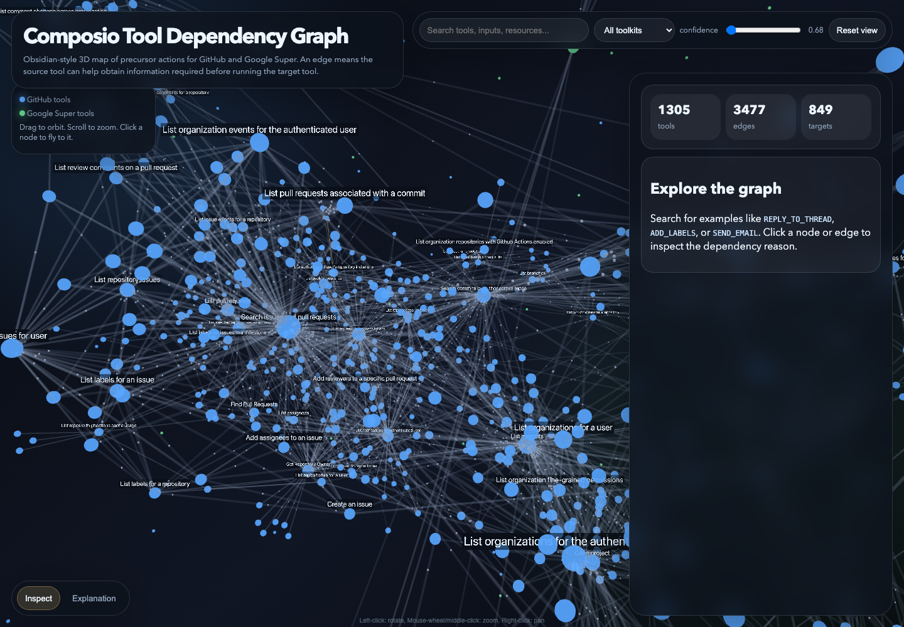
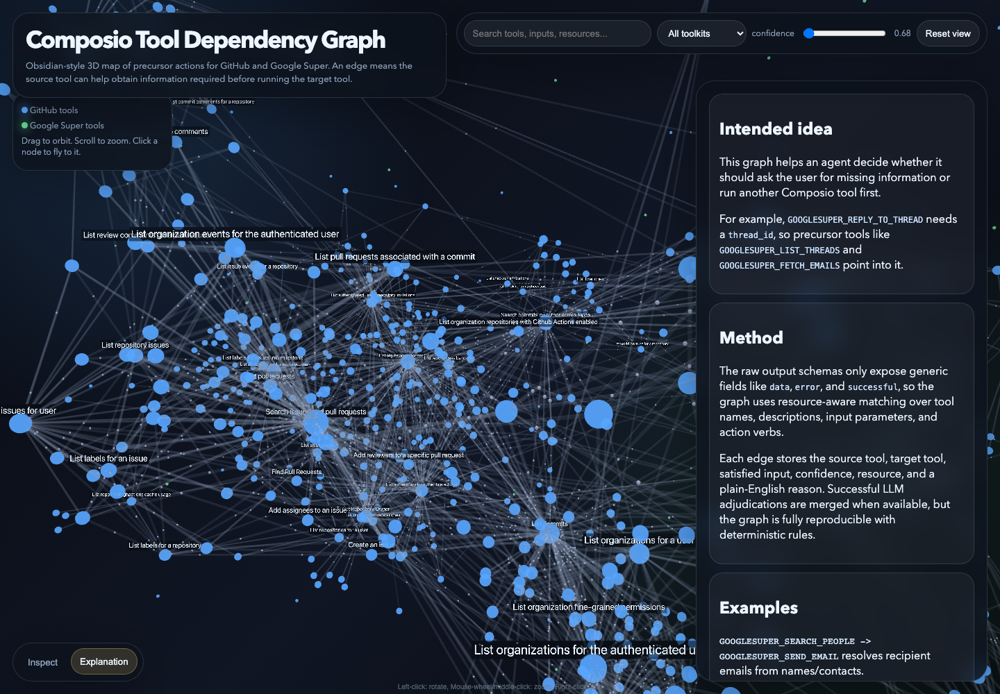

# 3D Composio Tool Dependency Graph

A dependency-graph pipeline for Composio's `github` and `googlesuper` toolkits. It maps which tools can act as precursor actions for other tools by identifying the IDs, references, and contextual inputs that target tools need before execution.

## Tech Stack

- TypeScript / Node.js for the graph pipeline.
- Composio SDK for tool extraction.
- Zod for structured validation.
- OpenRouter + StepFun for optional LLM edge adjudication.
- Three.js + 3d-force-graph for the Obsidian-style 3D explorer.
- Playwright for visual QA screenshots.
- Inline Python in `upload.sh` for safe session-token redaction.

See [TECHNICAL_OVERVIEW.md](TECHNICAL_OVERVIEW.md) for the full implementation breakdown.

## What It Does

- Fetches raw Composio tools for GitHub and Google Super.
- Normalizes 1,305 tool schemas into inspectable tool records.
- Infers dependency edges between tools using resource-aware matching rules.
- Supports optional OpenRouter/LLM adjudication for ambiguous edge selection.
- Produces a final graph with confidence-scored edges and plain-English reasons.
- Renders an 3D graph explorer with search, filtering, inspection, and an explanation tab.

## Final Output

- `dependency_graph.html` - interactive 3D graph visualization.
- `data/dependency_edges.json` - flat list of inferred dependency edges.
- `README_solution.md` - methodology and implementation details.
- `screenshots/` - visual verification of the graph and explanation tab.

## Screenshots





## Graph Semantics

An edge `A -> B` means:

> Tool A can help obtain information needed before Tool B can run safely or correctly.

Examples:

```text
GOOGLESUPER_LIST_THREADS -> GOOGLESUPER_REPLY_TO_THREAD
GOOGLESUPER_SEARCH_PEOPLE -> GOOGLESUPER_SEND_EMAIL
GITHUB_LIST_REPOSITORY_ISSUES -> GITHUB_ADD_LABELS_TO_AN_ISSUE
```

## Reproduce

```bash
npm install
npm run inventory
npm run graph:candidates
npm run graph:build
npm run graph:render
```

Optional LLM adjudication:

```bash
OPENROUTER_API_KEY=... npm run graph:infer
```

## Summary

This project turns ambiguous agent-tool dependencies into a concrete, inspectable graph for planning precursor actions across large Composio toolkits.
